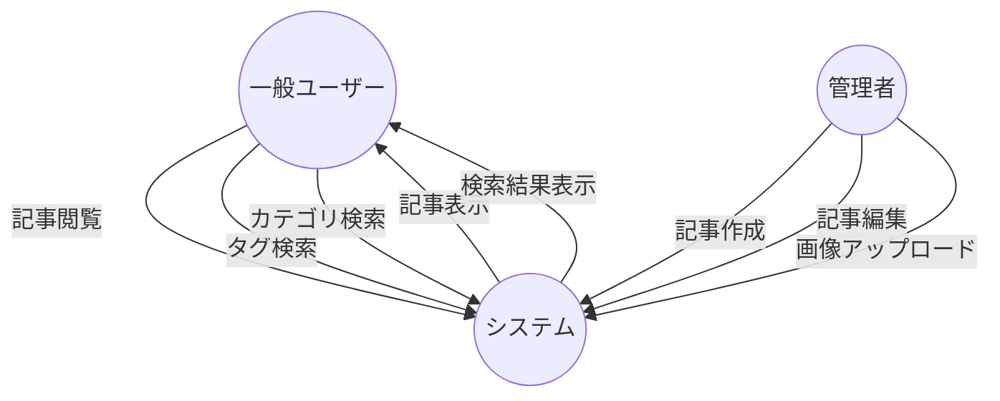
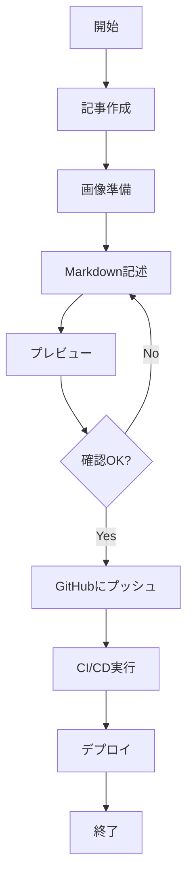

# Webブログ開発 - システム要件編

## 📚 Webブログ開発シリーズ

1. **[システム要件編](/portfolio/2025-0710)** ← 現在の記事
2. [システム設計編](/portfolio/2025-0712)
3. [機能設計編](/portfolio/2025-0716)
4. [Lambda実装編](/portfolio/2025-0719)
5. [運用設計編](/portfolio/2025-0721)
6. [フロントエンド編](/portfolio/2025-0725)
7. [監視・通知編](/portfolio/2025-0728)

---

## なぜWebブログを作ろうと思ったのか

DevOpsエンジニアとして開発メンバーの気持ちを理解したいと思ったのがきっかけでした！

また自分自身の欠点として発信力不足があったので、自分だけの発信基盤を作りたいと考えました。

（技術者として自分だけのブログを持っていることがかっこいいという下心もあったり）

## システム概要

### 目的
- 個人ブログサイトを構築し、技術的な成果物や経験を共有しつつ自分を知ってもらう

### 対象ユーザー
- 技術的な知見を共有したい技術者

## 大雑把な要件

### Webブログ名
色々紆余曲折ありましたが、`Pursuit`にすることにしました
由来は私がこれまで30回以上見た映画である、ウィル・スミス主演の「幸せのちから」です
（ただし、ブラウザ検索を考えると造語にした方が良かったよな〜と思ったり。Pursuitをもとにしたサービスが世の中多すぎた…。）

### ブログ機能
- 記事一覧の表示
- 記事詳細ページの表示
- 記事のカテゴリ分け（Portfolio/Life）
- 記事のタグ付け機能
- サムネや記事内での画像表示機能
- Markdown形式での記事作成

一般的な記事の機能に加え、記事を手軽に書けるようにmdファイルによる表示に拘りました。

### 技術スタック
- フロントエンド: Next.js 14, TypeScript, Tailwind CSS
- インフラ: AWS
- CI/CD: GitHub Actions
- コンテナ化: Docker
- IaC: CDKTF

おおよそ社内で利用される技術スタックをベースにしています。

ただし、CDKTFに関しては使われていないので個人的な趣味で使ってみました。

## ユースケース図

システムの主要なユースケースを図示します：

大雑把に作成していたユースケース図です。

誰が何をできるのかが一目で分かるので、開発中に「この機能は本当に必要か？」と悩んだ時に整理ができます。

## 記事投稿フロー

記事投稿の処理フローをアクティビティ図で表現します：

CI/CDで自動化しておけば、GitHubにプッシュするだけで自動的にデプロイされるので実際の作業は楽になります。

CDKTFはTerraformプロバイダーを利用しており、AWS以外のクラウドサービスもサポートできることが強みです。

今回はAWSのみ利用しますが、CDKTFを使うなら他のサービスと連携させることになると思うので、CI/CDとしてGitHub Actionsを採用することにしました。

## 次のステップ

要件定義が完了したら、次のフェーズである**システム設計**に進みます！

システム設計では、要件定義で明確にした機能をどのような技術構成で実現するかを詳細に設計していきます。
