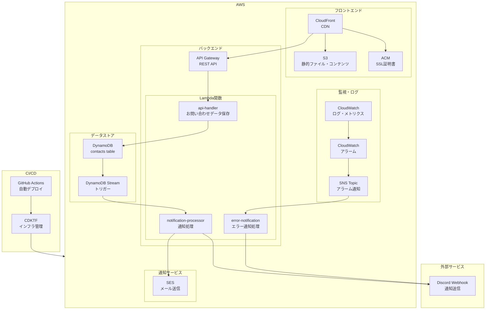
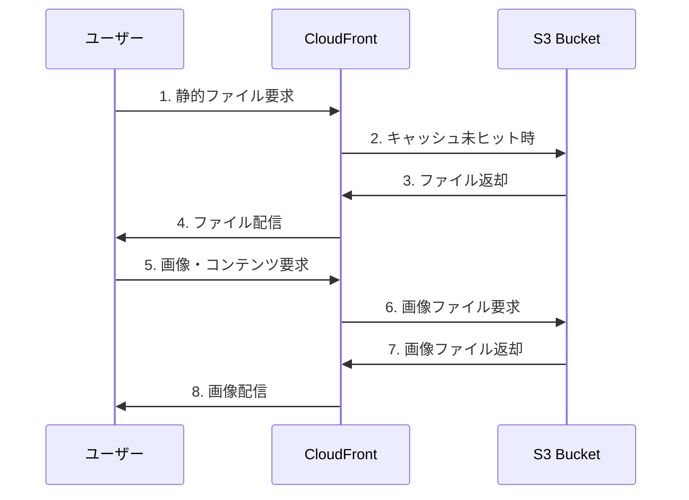
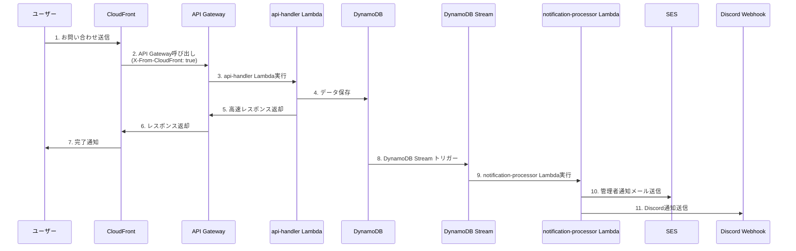
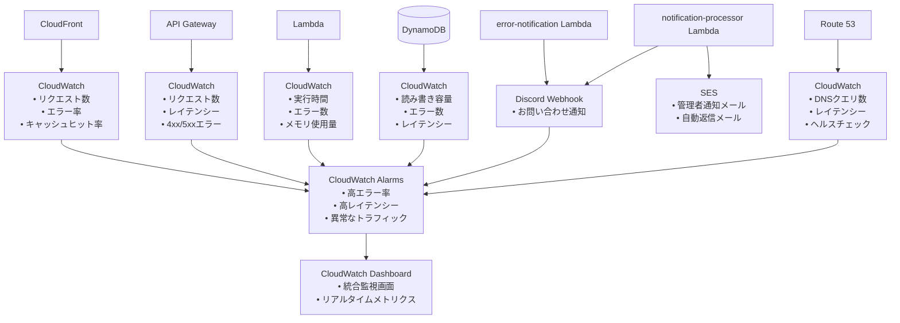

# Webブログ開発 - システム設計編

## 📚 Webブログ開発シリーズ

1. [システム要件編](/portfolio/2025-0710)
2. **[システム設計編](/portfolio/2025-0712)** ← 現在の記事
3. [機能設計編](/portfolio/2025-0716)
4. [Lambda実装編](/portfolio/2025-0719)
5. [運用設計編](/portfolio/2025-0721)
6. [フロントエンド編](/portfolio/2025-0725)
7. [監視・通知編](/portfolio/2025-0728)

---

システム要件フェーズで明確にした要件を基に、**システム設計フェーズ**では具体的な技術構成とアーキテクチャを設計します！

ここがエンジニアとして一番ワクワクする部分かもしれませんね。

## AWSアーキテクチャ図

システムの全体構成を図示します：



SSGアーキテクチャとして非常にシンプルな設計になっています。

データの流れが分かりやすいので、問題が起きた時の原因特定も楽になっていますね。

特に通知周りはDiscordに集約しているので、確認の手間が省けて非常に楽です！

### 主要コンポーネント

- **フロントエンド**: Next.js 15.3.3（静的サイト生成）
- **バックエンド**: Lambda Functions（api-handler、error-notification、notification-processor）
- **データストレージ**: DynamoDB（Streams有効）
- **CDN**: CloudFront
- **ストレージ**: S3
- **通知**: SES + Discord Webhook
- **監視**: CloudWatch + SNS

## データフロー

### 静的コンテンツ配信フロー



静的コンテンツの配信は、CloudFrontがキャッシュしてくれるので、実際のS3へのアクセスは最小限に抑えられます。

これにより、レスポンス時間も短くなり、コストも削減できます。

### API処理フロー



API処理の流れを見ると、ユーザーへのレスポンスと通知処理が分離されているのが分かりますね。

これにより、通知処理はバックグラウンドで非同期に実行されるので、ユーザーは待たされることなくすぐにレスポンスを受け取れます。

## データモデル

### DynamoDBテーブル設計

```typescript
// お問い合わせテーブル
interface Contact {
  id: string;           // プライマリキー
  name: string;
  email: string;
  subject?: string;
  message: string;
  createdAt: string;
  updatedAt: string;
}
```

データモデルは、シンプルに保つことを心がけました。

DynamoDBはNoSQLなので、複雑なリレーションは避けて、フラットな構造にしています。

## Lambda関数設計

### api-handler関数

**目的**: お問い合わせフォームの送信処理
**トリガー**: API Gateway (POST /contact)
**処理内容**:
- リクエストバリデーション
- DynamoDBへの保存
- 高速レスポンス返却
- DynamoDB Streamsによる非同期通知処理のトリガー

API Gatewayから渡されたお問い合わせ内容をDynamoDBに記録するためのLambda

### notification-processor関数

**目的**: 通知処理
**トリガー**: DynamoDB Streams
**処理内容**:
- お問い合わせ通知の送信
- SESによる管理者通知メール送信
- SESによる自動返信メール送信
- Discord Webhookへの通知送信

お問い合わせ内容をDiscordに通知するためのLambda。

おまけでSESの宛先として私のメールアドレスも設定している。

### error-notification関数

**目的**: エラー通知処理
**トリガー**: SNS Topic（CloudWatchアラーム）、CloudWatch Logs
**処理内容**:
- CloudWatchアラームの監視
- CloudWatch Logsの監視
- Discord Webhookへのエラー通知送信

DynamoDBやAPI Gatewayまたは各Lambda等、CloudWatchメトリクスやログでアラームが発生した際にDiscordに通知するLambda。

これを実装しておかないと、大事なお問い合わせが拾い上げられなかった時に気づけなくて怖い。

CloudWatchのメトリクスは、[AWS公式の推奨アラーム](https://docs.aws.amazon.com/ja_jp/AmazonCloudWatch/latest/monitoring/Best_Practice_Recommended_Alarms_AWS_Services.html#DynamoDB)を設定。

## 監視構成



## システム設計の特徴

### 1. サーバーレスアーキテクチャ
- **運用コスト削減**: 使用した分だけの課金
- **自動スケーリング**: トラフィックに応じた自動スケール
- **高可用性**: AWSの可用性を活用

### 2. 非同期処理
- **DynamoDB Streams**: データ変更の非同期通知処理
- **SNS**: アラーム通知の非同期処理
- **高速レスポンス**: ユーザーへの即座のレスポンス

### 3. セキュリティ
- **WAF**: Webアプリケーションファイアウォール
- **HTTPS強制**: 暗号化通信
- **IAM最小権限**: 必要最小限の権限設定

### 4. 監視・アラート
- **CloudWatch**: 統合監視
- **Discord Webhook**: リアルタイム通知
- **SNS**: アラーム通知

## 次のステップ

システム設計が完了したら、次のフェーズである**機能設計**に進みます。

機能設計では、各機能の詳細な実装方法やAPI設計を具体的に定義していきます。
