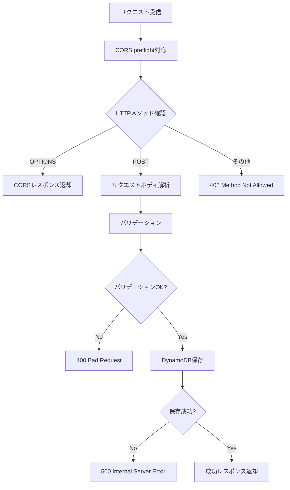
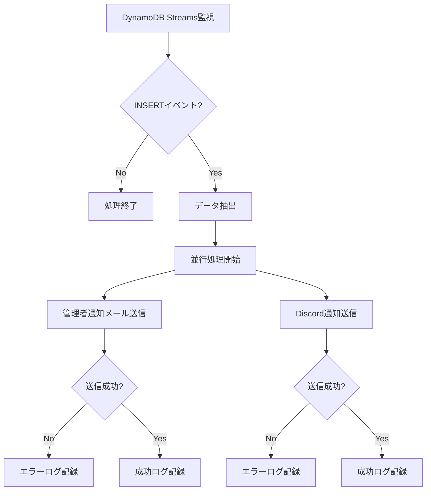

# Webブログ開発 - Lambda実装編

## 📚 Webブログ開発シリーズ

1. [システム要件編](/portfolio/2025-0710)
2. [システム設計編](/portfolio/2025-0712)
3. [機能設計編](/portfolio/2025-0716)
4. **[Lambda実装編](/portfolio/2025-0719)** ← 現在の記事
5. [運用設計編](/portfolio/2025-0721)
6. [フロントエンド編](/portfolio/2025-0725)
7. [監視・通知編](/portfolio/2025-0728)

---

機能設計フェーズで定義したAPI設計を基に、**Lambda関数の詳細実装**を行います。

このフェーズでは、各Lambda関数の処理フロー、CORS対応、非同期処理の実装方法を具体的に解説します。

## Lambda関数概要

### 実装するLambda関数
1. **API Handler Lambda**: お問い合わせデータの受信・保存
2. **Notification Processor Lambda**: 非同期通知処理
3. **Error Notification Lambda**: エラー監視・通知

### 共通仕様
- **ランタイム**: Node.js 20.x
- **タイムアウト**: 30-60秒
- **メモリ**: 256-512MB
- **ログ**: CloudWatch Logs

## 1. API Handler Lambda

### 基本情報
- **関数名**: `contact-api-handler-{environment}`
- **ランタイム**: Node.js 20.x
- **タイムアウト**: 30秒
- **メモリ**: 256MB
- **ハンドラー**: `index.handler`

### 処理フロー



### CORS preflight対応の必要性

**CORS preflight**は、ブラウザが異なるドメイン間のリクエストを安全に実行するための事前確認メカニズムです。

この対応がないと、ブラウザがAPI呼び出しをブロックし、お問い合わせフォームが正常に動作しなくなります。

**1. preflightリクエストの目的**
- ブラウザが実際のリクエスト前にOPTIONSメソッドで事前確認
- サーバーがCORSを許可しているかチェック
- セキュリティリスクを最小化

**2. 具体的な流れ**
```
フロントエンド: https://pursuit-blog.com
API Gateway: https://abc123.execute-api.ap-northeast-1.amazonaws.com

1. ブラウザがOPTIONSリクエスト送信
2. サーバーがCORS許可ヘッダーを返却
3. ブラウザが実際のPOSTリクエスト送信
4. サーバーがデータ処理を実行
```

**3. CORSレスポンス返却の内容**
```javascript
// OPTIONSリクエストへのレスポンス
{
  "Access-Control-Allow-Origin": "*",
  "Access-Control-Allow-Methods": "POST,OPTIONS",
  "Access-Control-Allow-Headers": "Content-Type,X-Amz-Date,Authorization,X-Api-Key,X-Amz-Security-Token",
  "Access-Control-Max-Age": "86400"
}
```

**4. なぜ必要なのか**
- **ブラウザのセキュリティポリシー**: 同一オリジンポリシーにより異なるドメイン間のリクエストが制限される
- **安全な通信**: 許可されたドメインからのみアクセス可能
- **ユーザー体験**: preflight対応がないとAPI呼び出しが失敗し、お問い合わせフォームが動作しない

### バリデーション処理

**必須フィールドチェック**
- 名前、メールアドレス、メッセージの必須チェック
- 不足しているフィールドの特定とエラーレスポンス

**メールアドレス形式チェック**
- 正規表現によるメールアドレス形式の検証
- 無効な形式の場合のエラーレスポンス

**文字数制限チェック**
- 名前（100文字以内）、メッセージ（2000文字以内）の制限
- 制限超過時のエラーレスポンス

### DynamoDB保存処理

**データ構造**
- ID、名前、メールアドレス、件名、メッセージ、タイムスタンプ、ステータスを含むオブジェクト
- 一意のID生成とISO形式のタイムスタンプ

**保存処理**
- DynamoDBへのPUT操作
- 成功時は201ステータスコードと成功レスポンス
- 失敗時は500ステータスコードとエラーレスポンス


*DynamoDBでのお問い合わせデータの保存処理。NoSQLデータベースの特性を活かして、高速でスケーラブルなデータ保存を実現しています。*

## 2. Notification Processor Lambda

### 基本情報
- **関数名**: `contact-notification-processor-{environment}`
- **ランタイム**: Node.js 20.x
- **タイムアウト**: 60秒
- **メモリ**: 512MB
- **トリガー**: DynamoDB Streams

DynamoDB Streamsを活用して非同期で通知処理を実行し、システムの信頼性を向上させています。

### 処理フロー



### DynamoDB Streams処理

**イベント解析**
- DynamoDB Streamsのレコードを順次処理
- INSERTイベントのみを対象として通知処理を実行

**データ抽出**
- DynamoDBのNewImageから必要なデータを抽出
- 名前、メールアドレス、件名、メッセージ、タイムスタンプを取得

### 並行通知処理

**管理者通知メール**
- SESを使用した管理者へのメール送信
- 件名、名前、メールアドレス、メッセージ内容を含む

**Discord通知**
- Discord Webhookを使用したリアルタイム通知
- 埋め込みメッセージ形式で見やすく表示


*Discord Webhookを使用したリアルタイム通知の実装。お問い合わせが送信されると、即座にDiscordチャンネルに通知が届きます。*

### エラーハンドリング

**個別エラー処理**
- Promise.allSettledを使用した並行処理
- 個別の通知失敗をログに記録

**リトライ機能**
- 最大3回のリトライ機能
- 指数バックオフによる待機時間の増加

## 3. Error Notification Lambda

### 基本情報
- **関数名**: `error-notification-{environment}`
- **ランタイム**: Node.js 20.x
- **トリガー**: CloudWatch Logs、SNS（アラーム）

CloudWatchとSNSを連携させて、問題の早期発見と迅速な対応を実現しています。

> **詳細は別記事「エラー監視・通知システム」で解説**

## 非同期処理の実装

### 1. ユーザー体験の最優先

**即座のレスポンス**
- データ保存後すぐにユーザーにレスポンス返却
- 通知処理は別途非同期で実行

**バックグラウンド処理**
- DynamoDB Streamsにより自動的にトリガー
- ユーザー体験に影響しない


*お問い合わせ送信成功時の画面。ユーザーは即座にレスポンスを受け取り、通知処理はバックグラウンドで非同期に実行されます。*

### 2. エラー分離

**通知処理の失敗がユーザー体験に影響しない**
- データ保存成功 = ユーザーへのレスポンス成功
- 通知処理の失敗は別途処理

## 次のステップ

Lambda関数の詳細実装が完了したら、次のフェーズである**運用設計**に進みます。

運用設計では、デプロイ手順、監視設定、運用プロセスを具体的に定義していきます。

Lambda関数実装で意識したことは、**ユーザー体験を最優先に考え、堅牢でスケーラブルな処理を実装すること**でしたが、ある程度考慮はできたのでこれでよしとする。
