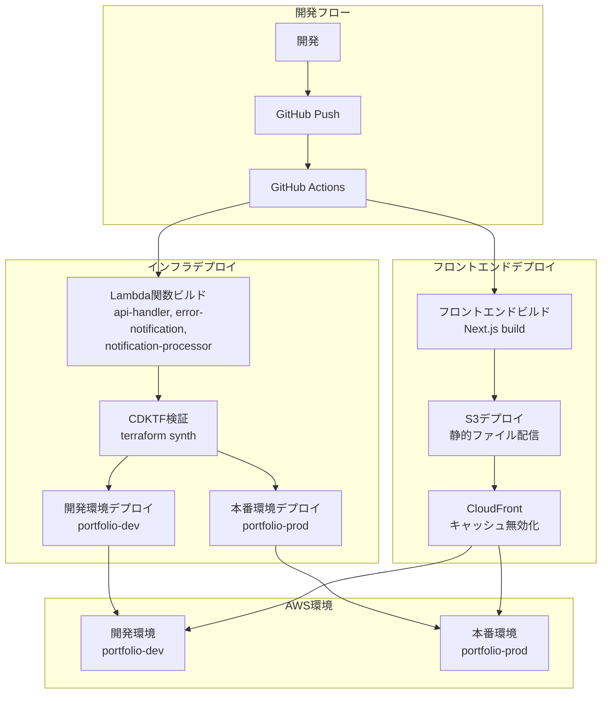

# Webブログ開発 - 運用設計編

## 📚 Webブログ開発シリーズ

1. [システム要件編](/portfolio/2025-0710)
2. [システム設計編](/portfolio/2025-0712)
3. [機能設計編](/portfolio/2025-0716)
4. [Lambda実装編](/portfolio/2025-0719)
5. **[運用設計編](/portfolio/2025-0721)** ← 現在の記事
6. [フロントエンド編](/portfolio/2025-0725)
7. [監視・通知編](/portfolio/2025-0728)

---

機能設計フェーズで詳細に設計した機能を基に、**運用設計フェーズ**ではデプロイ手順、監視設定、運用プロセスを具体的に定義します。

このフェーズでは、AWS CDKTFを使用したサーバーレス構成で、環境別のデプロイを実現しています。

（ただし構築すると環境ごとの料金がかかるので本番環境だけ実装しています）

## 環境構成

### 環境一覧
- **開発環境**: `dev`
- **本番環境**: `prod`

開発と本番の環境を明確に分離し、それぞれに最適化された設定を提供しています。

### 環境別設定
```typescript
// infra/lib/config.ts
export const environments = {
  dev: {
    environment: "dev",
    region: "ap-northeast-1",
    logRetentionDays: 7,
    // その他の設定
  },
  prod: {
    environment: "prod",
    region: "ap-northeast-1",
    logRetentionDays: 30,
    // その他の設定
  },
};
```

TypeScriptでデプロイ先のAWSの環境変数を管理し、型安全性と保守性を向上させています。

メールアドレスなどGitHubに載せたくない情報については、SecretsManager等に直接シークレットの値を入力しています。

## デプロイフロー



GitHub ActionsとCDKTFを連携させて、自動化されたデプロイメントを実現しています。

(繰り返しですが開発環境は設定してみただけ)

## デプロイ確認

### インフラ確認
```bash
# CDKTFの状態確認
cd infra
npm run diff
```

CDKTFによる状態確認で、デプロイの成功を検証。

### アプリケーション確認
- **フロントエンド**: ブラウザでアクセス確認
- **API**: API Gatewayのエンドポイント確認
- **Lambda関数**: CloudWatchログで動作確認

バックエンドの更新が入った場合は、テストとしてお問い合わせを実施して動作確認も実施。

## 次のステップ

次はフロントエンドの開発フェーズになります。

Next.jsを利用したアーキテクチャにしていますが、ここからやっとユーザーから見える部分を触れるので一番面白いところかもしれません。
