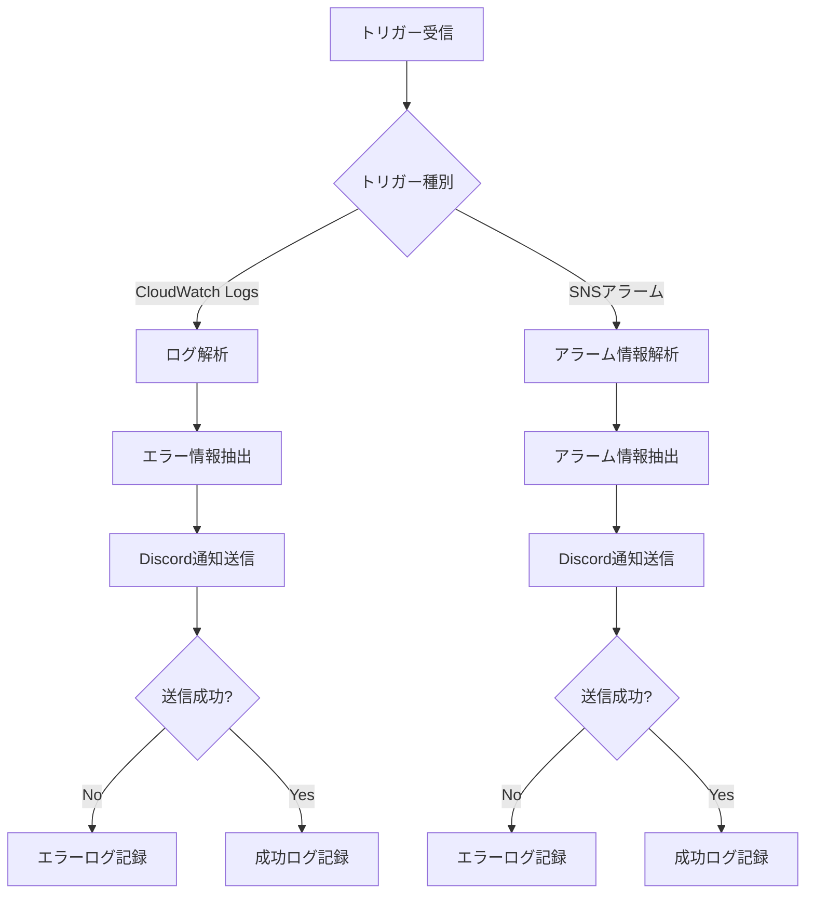
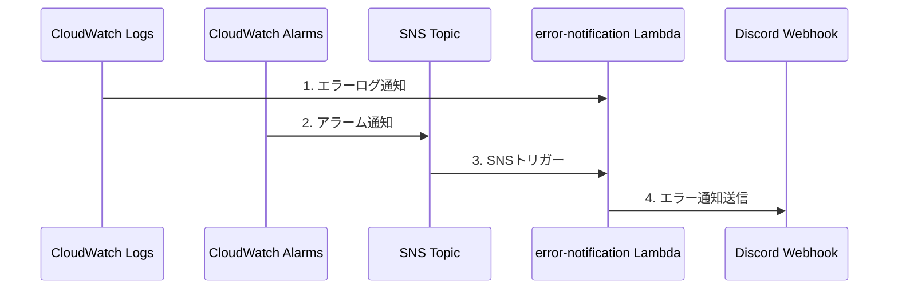

# Webブログ開発 - 監視・通知編

## 📚 Webブログ開発シリーズ

1. [システム要件編](/portfolio/2025-0710)
2. [システム設計編](/portfolio/2025-0712)
3. [機能設計編](/portfolio/2025-0716)
4. [Lambda実装編](/portfolio/2025-0719)
5. [運用設計編](/portfolio/2025-0721)
6. [フロントエンド編](/portfolio/2025-0725)
7. **[監視・通知編](/portfolio/2025-0722)** ← 現在の記事

---

ポートフォリオサイトでは、**エラー監視と通知システム**を構築して、問題の早期発見と迅速な対応を実現しています。

このシステムにより、ユーザー体験の劣化を防ぎ、安定したサービスを提供できます。

## エラー監視システム概要

### 監視対象
- **API Gateway**: 4XX/5XXエラー率、レイテンシー
- **Lambda関数**: エラー率、実行時間、メモリ使用率
- **DynamoDB**: スロットリング、エラー率
- **CloudWatch Logs**: エラーログの自動検出

### 通知チャネル
- **Discord Webhook**: リアルタイム通知
- **SNS Topic**: アラーム通知の集約
- **CloudWatch Alarms**: メトリクスベースの監視

## Error Notification Lambda

### 基本情報
- **関数名**: `error-notification-{environment}`
- **ランタイム**: Node.js 20.x
- **トリガー**: CloudWatch Logs、SNS（アラーム）

CloudWatchとSNSを連携させて、問題の早期発見と迅速な対応を実現しています。

### 処理フロー



### エラー情報の構造

**CloudWatch Logsからのエラー情報**
```json
{
  "timestamp": "2025-01-XX",
  "level": "ERROR",
  "service": "api-handler",
  "message": "DynamoDB connection failed",
  "details": {
    "errorCode": "ResourceNotFoundException",
    "requestId": "abc123"
  }
}
```

**SNSアラームからの情報**
```json
{
  "AlarmName": "API-Gateway-5XX-Error-Rate",
  "StateValue": "ALARM",
  "StateReason": "Threshold Crossed",
  "MetricValue": "8.5",
  "Threshold": "5.0"
}
```

## 監視・アラート設定

### 1. API Gateway監視
- **4XXエラー率**: 5%超過でアラーム
- **5XXエラー率**: 5%超過でアラーム
- **リクエスト数**: 1分間1リクエスト未満でアラーム
- **レイテンシー**: 2.5秒超過でアラーム
- **統合レイテンシー**: 2秒超過でアラーム

エラー率とレイテンシーを監視し、ユーザー体験の劣化を早期に検知しています。


*CloudWatchアラームの設定画面。API Gatewayのエラー率やレイテンシーを監視し、閾値を超えた場合にアラームを発報します。*

### 2. Lambda関数監視
- **エラー率**: 5%超過でアラーム
- **実行時間**: タイムアウトの80%超過でアラーム
- **メモリ使用率**: 80%超過でアラーム

実行時間とメモリ使用率を監視し、パフォーマンスの最適化を継続的に行っています。

### 3. DynamoDB監視
- **スロットリング**: 1分間に1回以上でアラーム
- **エラー率**: 5%超過でアラーム
- **読み取り容量**: 80%超過でアラーム
- **書き込み容量**: 80%超過でアラーム

データベースの性能劣化を早期に検知し、ユーザー体験の維持を図っています。


*DynamoDBアラームの設定画面。スロットリングの発生やエラー率を監視し、データベースの性能劣化を早期に検知します。*

## エラー監視フロー



先ほどのお問い合わせの通知と同様に、エラー通知もDiscordに通知させるようにしています。

## Discord通知の実装

### 通知メッセージ

**CloudWatch Logsエラー**
```
🚨 **エラーが発生しました**
**サービス**: api-handler
**時刻**: 2025-01-XX 10:30:00
**エラー**: DynamoDB connection failed
**詳細**: ResourceNotFoundException
```

**SNSアラーム**
```
⚠️ **アラームが発生しました**
**アラーム名**: API-Gateway-5XX-Error-Rate
**状態**: ALARM
**値**: 8.5% (閾値: 5.0%)
**理由**: Threshold Crossed
```

### Discord Webhook設定
- **URL**: 環境変数から取得
- **メッセージ形式**: Markdown対応
- **通知頻度**: リアルタイム
- **重複防止**: 同一エラーの集約
