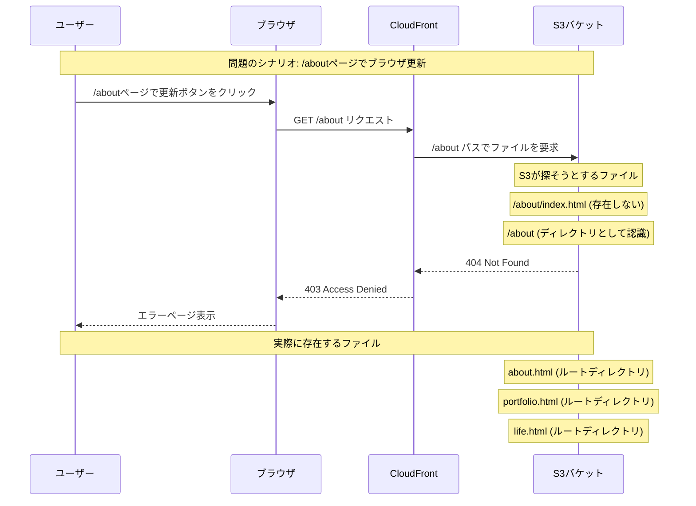
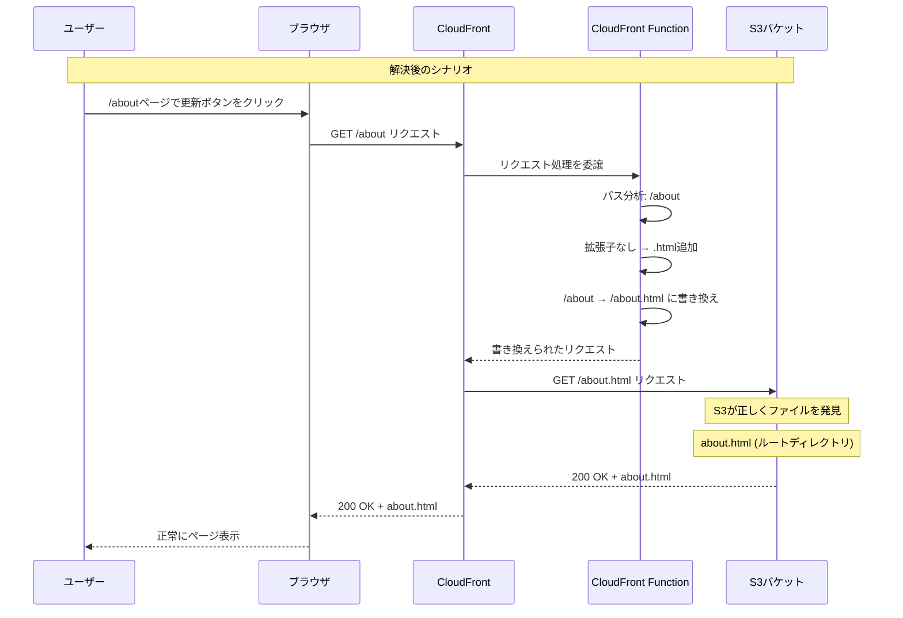

## 問題の概要

先日、ポートフォリオサイトで深刻な問題が発生していました。ブラウザ上でhomeページ以外のページ（例：`/about`、`/portfolio`など）で更新ボタンを押すと、**403 access denied**エラーが表示されるという問題です。

この問題は明らかにパスの問題である可能性が高く、ユーザーエクスペリエンスに大きな影響を与えていました。

## 調査結果

問題の原因を特定するために、関連する記事を調査しました。以下の2つの解決法が見つかりました：

1. [Next.jsでSSGした静的サイトをS3でホスティングする際のCSR後リロード時404問題の解決](https://qiita.com/ryokkkke/items/1478a022b220bf6e61ff)
2. [CloudFront Functionsを利用してインデックスドキュメント機能を実装](https://dev.classmethod.jp/articles/cloudfront-functions-index-docum/)

このうち今回は、2番で解決できたのでそちらを紹介していきます。

## なぜ403エラーが起きるのか

この問題は、Next.jsのクライアントサイドルーティングとS3の静的ホスティングの仕組みの違いによって発生します。

### Next.jsの画面遷移（クライアントサイドルーティング）

ユーザーがサイト内を移動する際（例：トップページからAboutページへ）、Next.jsのルーターがブラウザのURLを書き換え、JavaScriptが対応するコンポーネントを描画します。この時点ではサーバーへのリクエストは発生せず、すべてブラウザ内で処理が完結します。

### ページのリロード（サーバーへのリクエスト）

しかし、ユーザーが `/about` や `/portfolio` のようなページでブラウザのリロードボタンを押すと、ブラウザはS3サーバーに対して「`/about`というパスのファイル（具体的には`/about/index.html`）をください」というリクエストを直接送信します。

### S3の応答

`next export`で生成される静的ファイルには、`/about.html`や`/portfolio.html`のようなHTMLファイルは存在しますが、ブラウザが`/about`や`/portfolio`というパスでリクエストした場合、S3はこれらのファイルを正しく認識できません。

S3にデプロイされた静的ファイルバケットには以下のファイルが存在します：
- `about.html` - AboutページのHTMLファイル
- `portfolio.html` - PortfolioページのHTMLファイル
- `life.html` - LifeページのHTMLファイル
- `contact.html` - ContactページのHTMLファイル

しかし、ブラウザが`/about`というパスでリクエストすると、S3は`/about/index.html`を探そうとして失敗し、404 Not Foundエラーを返します。

この404エラーが、CloudFrontを通じて配信される際に403 Access Deniedエラーとして表示されることがあります。これは、CloudFrontの設定やS3のアクセス権限の問題と組み合わさって発生する複合的な問題です。

これは、Next.jsに限らず、ReactやVueなどで作られた単一ページアプリケーション（SPA）を静的ホスティングする際に共通して起こる典型的な問題です。

## 問題の経緯を視覚的に理解

この問題の流れをMermaidダイアグラムで詳しく説明します。

### 問題の流れ



## 技術選定：CloudFront Functions vs Lambda@Edge

### なぜCloudFront Functionsを選択したのか

この問題を解決するために、[AWS公式ドキュメント](https://docs.aws.amazon.com/ja_jp/AmazonCloudFront/latest/DeveloperGuide/edge-functions-choosing.html)を参考に、CloudFront FunctionsとLambda@Edgeの違いを検討しました。

#### CloudFront Functions vs Lambda@Edge

| 項目 | CloudFront Functions | Lambda@Edge |
|------|---------------------|-------------|
| 実行時間 | サブミリ秒 | 最大5-30秒 |
| スケール | 1秒あたり最大数百万のリクエスト | 1リージョンあたり毎秒10,000件まで |
| メモリサイズ | 2 MB | 128 MB - 10 GB |
| コードサイズ | 10 KB | 50 MB |
| ネットワークアクセス | なし | あり |
| ビルド・テスト | CloudFrontで完結 | 外部環境が必要 |

#### 今回のユースケースに最適な理由

1. **URLリダイレクト・書き換えに特化**: 公式ドキュメントによると、CloudFront Functionsは「URLリダイレクトまたは書き換え」のユースケースに最適です。まさに今回のSPAルーティング問題の解決に該当します。

2. **軽量で高速**: サブミリ秒での実行と1秒あたり数百万リクエストの処理能力により、ユーザー体験に影響を与えることなく高速にリクエストを書き換えできます。

3. **シンプルな実装**: 複雑なライブラリや外部サービスへのアクセスが不要で、純粋なJavaScript（ECMAScript 5.1準拠）で実装できます。

4. **コスト効率**: 軽量な関数のため、実行コストが低く抑えられます。

5. **CloudFront統合**: ビルドからテストまでCloudFront環境内で完結し、デプロイが簡単です。

## 最終的な解決策

今回は、静的ファイルをホスティングしているS3の前段に配置したCloudFrontを利用しました。CloudFront Functionsを使い、以下のようなロジックでリクエストを書き換えることで、すべての問題を解決しました。

### 解決の流れ

1. **ユーザーが `https://pursuit-blog.com/about` にアクセスする**
2. **CloudFrontがリクエストを受け取る**
3. **CloudFront Functionsが起動し、リクエストされたパス `/about` に拡張子がないことを確認する**
4. **FunctionsがリクエストのURIを `/about.html` に書き換える**
5. **CloudFrontは書き換えられたリクエストをオリジン（S3）に送り、ファイルを取得してユーザーに返す**

この方法により、ブラウザ上のURLは `https://pursuit-blog.com/about` のまま、実際に表示されるのは `about.html` の内容、というSPAの理想的な挙動を実現できました。

### 実際のファイル構造との対応

静的ファイルバケットの実際の構造に基づくと：
- ユーザーが `/about` にアクセス → CloudFront Functionが `/about.html` に書き換え → S3から`about.html`を取得
- ユーザーが `/portfolio` にアクセス → CloudFront Functionが `/portfolio.html` に書き換え → S3から`portfolio.html`を取得
- ユーザーが `/life` にアクセス → CloudFront Functionが `/life.html` に書き換え → S3から`life.html`を取得

これにより、Next.jsの`next export`で生成されたHTMLファイルを正しく配信できるようになります。

### 解決策の流れ



## 実装の詳細

### CloudFront Functionのコード

```javascript
function handler(event) {
	const request = event.request;
	const uri = request.uri;

	// 静的ファイルの拡張子をチェック
	const staticExtensions = [
		".html", ".css", ".js", ".json", ".png", ".jpg", ".jpeg",
		".gif", ".svg", ".ico", ".webp", ".woff", ".woff2", ".ttf", ".eot"
	];

	const hasStaticExtension = staticExtensions.some((ext) => uri.endsWith(ext));

	// 静的ファイルの場合はそのまま通過
	if (hasStaticExtension) {
		return request;
	}

	// APIエンドポイントの場合はそのまま通過
	if (uri.startsWith("/api/")) {
		return request;
	}

	// ルートパスの場合
	if (uri === "/") {
		request.uri = "/index.html";
		return request;
	}

	// 拡張子がない場合の処理
	if (!uri.includes(".")) {
		// 末尾がスラッシュで終わる場合はindex.htmlを追加
		if (uri.endsWith("/")) {
			request.uri = uri + "index.html";
		} else {
			// 拡張子がない場合は.htmlを追加
			request.uri = uri + ".html";
		}
	}

	return request;
}
```

### 重要なポイント

- **テンプレートリテラルの使用を避ける**: `${...}`構文はTerraformの変数展開構文と衝突するため、文字列結合（`+`演算子）を使用
- **静的ファイルの判定**: 既存の拡張子を持つファイルはそのまま通過させる
- **APIエンドポイントの保護**: `/api/`で始まるパスは変更しない
- **SPAルーティングの対応**: 拡張子のないパスを適切なHTMLファイルにマッピング

## 学んだこと

### 1. SPAのルーティング問題の複雑さ

単純な静的サイトホスティングでは、ブラウザの更新時に404エラーが発生する問題が一般的に存在します。これは、サーバーサイドでルーティングが処理されないためです。

### 2. CloudFront Functionsの威力

CloudFront Functionsを使用することで、CDNレベルでリクエストを書き換えることができ、サーバーサイドの変更なしにルーティング問題を解決できます。

### 3. インフラコードの注意点

CDK for Terraform（CDKTF）を使用する際は、JavaScriptコード内のテンプレートリテラルがTerraformの変数展開構文と衝突しないよう注意が必要です。

## まとめ

CloudFront Functionsを使用することで、SPAのルーティング問題を効率的に解決できました。この解決策により、ユーザーはどのページからでも安全にページを更新できるようになり、サイトの使いやすさが大幅に向上しました。

AWSのマネージドサービスを活用することで、複雑なルーティングロジックを実装することなく、高パフォーマンスなSPAサイトを構築できることを実感しました。

今回のケースでは、解決策１番として記載した[Next.jsでSSGした静的サイトをS3でホスティングする際のCSR後リロード時404問題の解決](https://qiita.com/ryokkkke/items/1478a022b220bf6e61ff)では解決できませんでした。その理由も次回記載します。

---

**参考資料:**
- [Next.jsでSSGした静的サイトをS3でホスティングする際のCSR後リロード時404問題の解決](https://qiita.com/ryokkkke/items/1478a022b220bf6e61ff)
- [CloudFront Functionsを利用してインデックスドキュメント機能を実装](https://dev.classmethod.jp/articles/cloudfront-functions-index-docum/)
- [CloudFront Functions と Lambda@Edge の違い - Amazon CloudFront](https://docs.aws.amazon.com/ja_jp/AmazonCloudFront/latest/DeveloperGuide/edge-functions-choosing.html)
